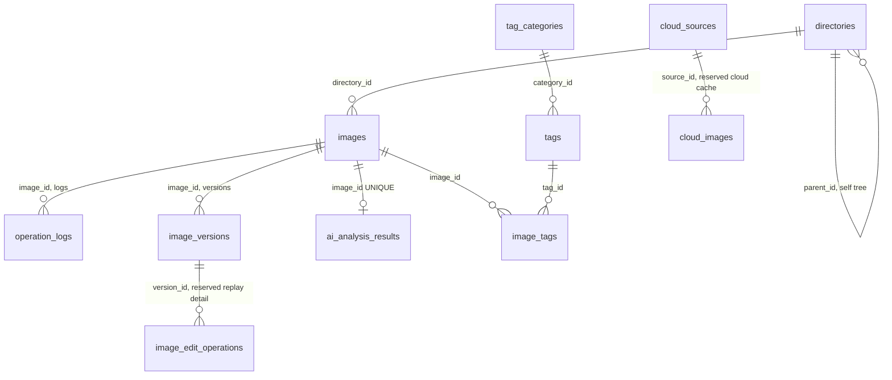

# ER 关系最终口径

本说明依据 `sql/schema.sql`、`README.md`、`DirectoryDaoImpl`、`ImageDaoImpl`、`TagDaoImpl`、`VersionDaoImpl`、`SettingsDaoImpl`、`SearchService`、`AiTagStorageService` 和 `EditService` 核对。答辩时统一按“子表外键指向父表主键”解释关系，不按图上箭头自行猜方向。

## 1. 最核心的读法

`images` 是图片主表。每张图片属于一个目录，目录通过 `directories.parent_id` 自引用形成树；图片可以有多个版本、多个操作日志、最多一条 AI 完整分析结果；图片和标签不是直接多对多，而是通过 `image_tags` 中间表拆成两条多对一关系。

## 2. 外键方向与基数

| 子表.外键 | 父表.主键 | 基数口径 | 删除规则 | 讲解口径 |
|---|---|---|---|---|
| `directories.parent_id` | `directories.id` | 子目录 N : 1 父目录；根目录为 NULL | `ON DELETE CASCADE` | 目录树自引用，父目录删除时子目录链随之删除。 |
| `images.directory_id` | `directories.id` | 图片 N : 1 目录 | `ON DELETE CASCADE` | 一个目录可有多张图片，一张图片只属于一个目录。 |
| `operation_logs.image_id` | `images.id` | 日志 0..N : 1 图片 | `ON DELETE SET NULL` | 日志依附图片，但图片物理删除后日志仍保留审计痕迹。 |
| `tags.category_id` | `tag_categories.id` | 标签 N : 1 标签分类 | `ON DELETE CASCADE` | 一个分类下有多个标签，一个标签只属于一个分类。 |
| `image_tags.image_id` | `images.id` | 图片标签关联 N : 1 图片 | `ON DELETE CASCADE` | 这是图片到标签多对多的中间表的一半。 |
| `image_tags.tag_id` | `tags.id` | 图片标签关联 N : 1 标签 | `ON DELETE CASCADE` | `UNIQUE(image_id, tag_id)` 保证同一图片不会重复挂同一标签。 |
| `ai_analysis_results.image_id` | `images.id` | AI 结果 0..1 : 1 图片 | `ON DELETE CASCADE` | `image_id UNIQUE`，所以一张图片最多一条完整 AI 分析缓存。 |
| `image_versions.image_id` | `images.id` | 版本 N : 1 图片 | `ON DELETE CASCADE` | 一张图片可以有多个编辑快照，`is_current` 标记当前版本。 |
| `image_edit_operations.version_id` | `image_versions.id` | 编辑操作 N : 1 版本 | `ON DELETE CASCADE` | 数据库层预留的操作回放明细表，当前主流程以版本快照为准。 |
| `cloud_images.source_id` | `cloud_sources.id` | 云端图片 N : 1 云源 | `ON DELETE CASCADE` | WebDAV/云端同步预留扩展，不作为当前已实现主流程。 |

`app_settings` 和 `search_history` 没有外键。前者是应用配置键值表，后者记录关键词搜索和 AI SQL 搜索历史。

删除与恢复不要说成“只改数据库标记”或“先标记再永久删除”。当前实现是：`images.is_deleted` 负责把图片从主视图过滤出去，`deleted_original_path`、`deleted_storage_path` 和 `deleted_at` 记录恢复所需信息；磁盘文件会移动到原目录的 `.versions/.trash` 隐藏回收区。恢复中心负责把文件移回原目录并清空删除状态，剪切/粘贴误操作也通过 `operation_logs` 中的 `PASTE`、`MOVE` 记录做最近一次撤销。

## 3. 不会混淆的答辩说法

可以直接说：本系统有 13 张表，但核心 ER 不是 13 张都挤在一张图里。主流程围绕 `images` 展开：`directories` 提供目录维度，`image_versions`、`operation_logs`、`ai_analysis_results` 依附图片，`tag_categories` 和 `tags` 构成标签字典，`image_tags` 是图片和标签的多对多中间表。`app_settings`、`search_history` 是运行辅助表，`cloud_sources`、`cloud_images` 和 `image_edit_operations` 属于扩展预留或非主流程对象。

## 4. 可复制的 Mermaid ER

## 5. PPT 上建议保留的最小核心图

如果 PPT 空间有限，只画 8 个主流程对象即可：`directories`、`images`、`operation_logs`、`image_versions`、`ai_analysis_results`、`tag_categories`、`tags`、`image_tags`。图旁边必须保留一句说明：箭头统一表示“子表外键指向父表主键”，并标明 `image_tags` 是拆解 `images` 与 `tags` 多对多关系的中间表。
